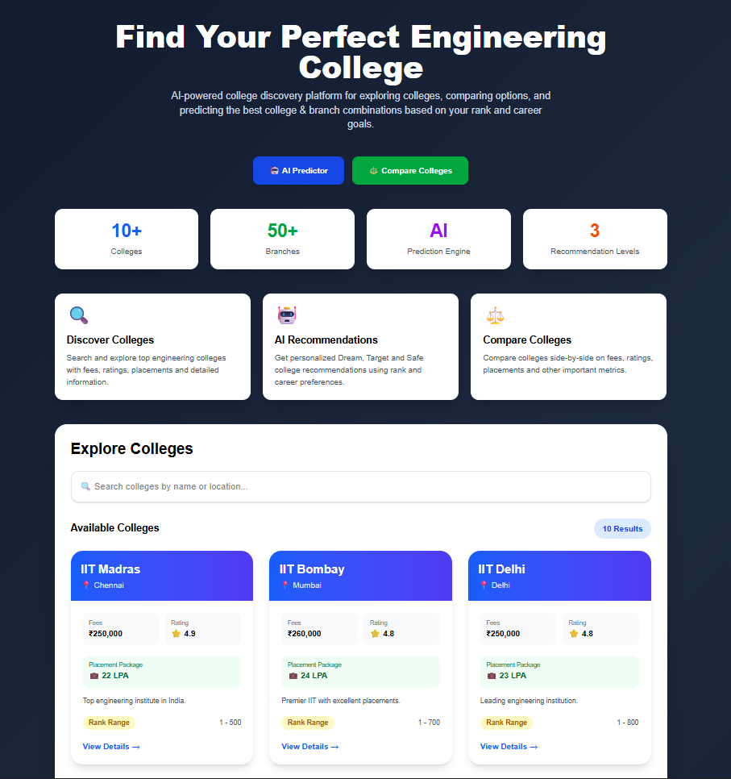
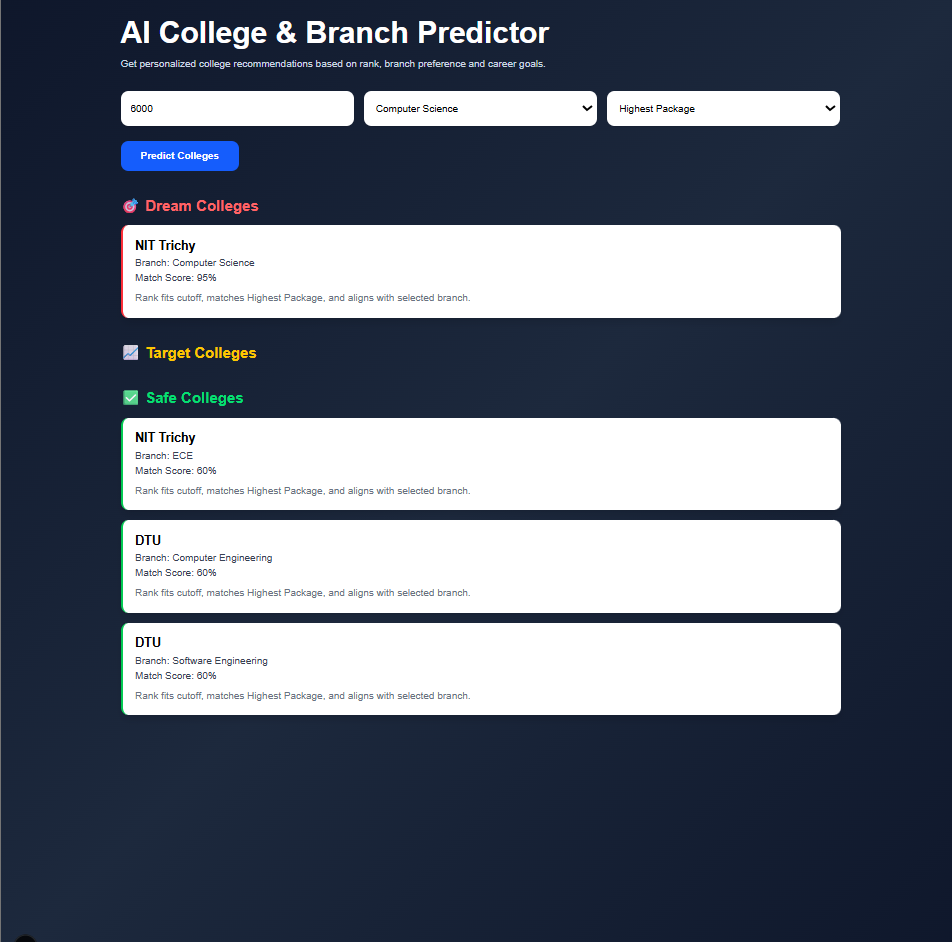
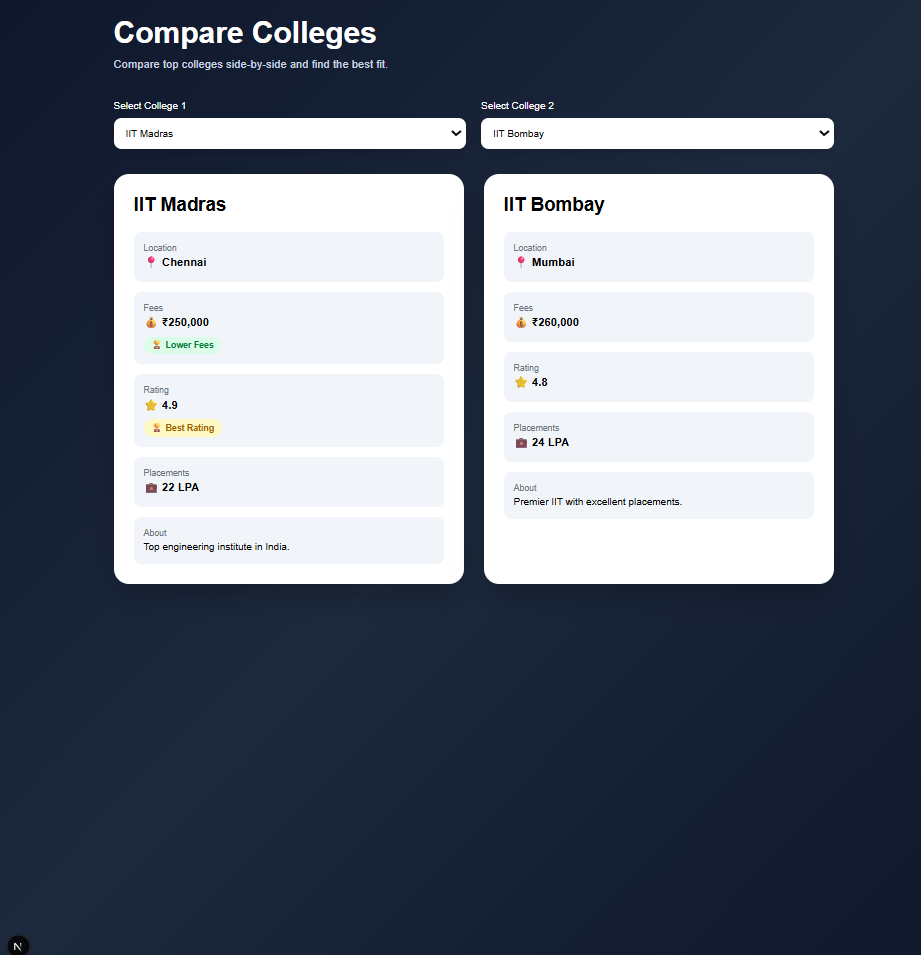
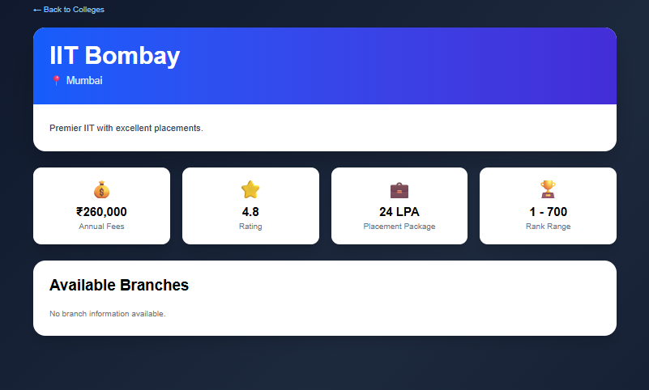

# 🎓 AI-Powered College Discovery Platform

A modern full-stack web application that helps students discover engineering colleges, compare institutions, and receive personalized college and branch recommendations using an intelligent recommendation engine.

---

## 🚀 Live Demo

**Deployment:** [Add your Vercel URL here]

**GitHub Repository:** [Add your GitHub URL here]

---

## 📌 Problem Statement

Choosing the right engineering college is a challenging process for students due to the large number of institutions, varying branch opportunities, placement statistics, and cutoff trends.

This platform simplifies the decision-making process by providing:

* College discovery
* Detailed college information
* Side-by-side college comparison
* AI-powered college and branch recommendations

---

## ✨ Features

### 🔍 College Discovery

* Search colleges instantly
* Browse engineering institutions
* View ratings, fees, placements, and descriptions
* Explore detailed college profiles

### 🤖 AI College & Branch Predictor

Students can receive recommendations based on:

* JEE Rank
* Branch Preference
* Career Goal

Recommendations are categorized into:

* 🟢 Safe
* 🟡 Target
* 🔴 Dream

The recommendation engine evaluates:

* Rank suitability
* Branch compatibility
* Placement potential
* Coding culture
* Research opportunities
* Alumni strength

### ⚖️ College Comparison

Compare colleges side-by-side using:

* Fees
* Ratings
* Placements
* Location
* Description

### 🏫 Detailed College Profiles

Each college page includes:

* College overview
* Placement information
* Rank range
* Branch availability
* Branch-specific analytics

---

## 🖼️ Screenshots
### Homepage



### AI Predictor



### College Comparison



### College Details



---

## 🛠️ Tech Stack

### Frontend

* Next.js 16
* React 19
* TypeScript
* Tailwind CSS

### Backend

* Next.js API Routes
* Prisma ORM

### Database

* PostgreSQL (Neon)

### Deployment

* Vercel

---

## 🏗️ System Architecture

```text
User
 ↓
Next.js Frontend
 ↓
API Routes
 ↓
Prisma ORM
 ↓
PostgreSQL Database
```

---

## 📂 Project Structure

```text
app/
 ├── api/
 │   ├── colleges/
 │   └── predictor/
 │
 ├── college/[id]/
 ├── compare/
 ├── predictor/
 ├── components/
 │
lib/
 └── prisma.ts

prisma/
 ├── schema.prisma
 └── seed.ts
```

---

## 🧠 Recommendation Logic

The recommendation engine generates recommendations using:

* Student rank analysis
* Branch preference matching
* Placement opportunities
* Research potential
* Coding culture score
* Alumni network strength

The final recommendations are classified into:

* Dream Colleges
* Target Colleges
* Safe Colleges

---

## ⚙️ Installation

### Clone Repository

```bash
git clone <repository-url>
cd college-discovery-platform
```

### Install Dependencies

```bash
npm install
```

### Configure Environment Variables

Create a `.env` file:

```env
DATABASE_URL=your_neon_database_url
```

### Generate Prisma Client

```bash
npx prisma generate
```

### Seed Database

```bash
npx tsx prisma/seed.ts
```

### Run Development Server

```bash
npm run dev
```

---

## 🚀 Deployment

The application is deployed using:

* Vercel
* Neon PostgreSQL

Production deployment automatically rebuilds whenever changes are pushed to GitHub.

---

## 🔮 Future Enhancements

* Real-world JEE cutoff datasets
* Category-wise predictions
* State quota analysis
* Placement trend analytics
* AI-powered career recommendations
* Student reviews and ratings
* Advanced filtering and sorting

---

## 👨‍💻 Developer

**Sikhakolli Lakshman Guru Sai**

Built as a full-stack engineering project using modern web technologies and database-driven recommendation systems.

---

## 📄 License

This project is intended for educational, learning, and demonstration purposes.
